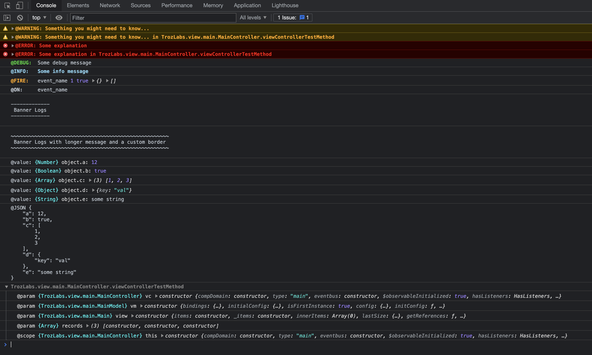

# ext-log

clone to your workspace or application `./packages/local/ext-log`.



Add package name to the requires array in `app.json`

```jsonc
    "requires": [
        "font-awesome",
        "google",
        "charts",
        "ux",

        "ext-log"
    ],
```

Example Usage:

```javascript
/**
 * This class is the controller for the main view for the application. It is specified as
 * the "controller" of the Main view class.
 */
Ext.define('TrozLabs.view.main.MainController', {
    extend: 'Ext.app.ViewController',
    alias: 'controller.main',
    requires: [
        'Log'
    ],

    init() {
        this.viewControllerTestMethod(
            this, 
            this.getViewModel(), 
            this.getView(), [
                new Ext.data.Model(),
                new Ext.data.Model(),
                new Ext.data.Model()
            ]
        );
    },

    viewControllerTestMethod(vc, vm, view, records) {

        Log.warn('Something you might need to know...');
        Log.warn('Something you might need to know...', {
            args: arguments,
            scope: this
        });
        
        // Warn only when value passed in is truthy.
        Log.warnIf(true, 'Something you might need to know if a condition is true');

        // Error logs will return the error so it can be thrown on it's own.
        // Passing in an error will extract the message and passing in a 
        // string will create an error for you.
        Log.error('Some explanation');
        Log.error('Some explanation', { 
            args: arguments,
            scope: this,
            throws: false 
        });
        
        Log.debug('Some debug message');
        Log.info('Some info message');
        
        // Something to highlight events fired and event revieved.
        Log.fire('event_name', 1, true, {}, []);
        Log.on('event_name');
        
        // Make it stand out a bit with a Banner message. The banner width is based on the message passed in.
        Log.banner(`Banner Logs`);
        Log.banner(`Banner Logs with longer message and a custom border`, '~');

        // Log a value with an optional description and Log.value() returns the value un touched
        object = {};
        object.a = Log.value(12,                'object.a');
        object.b = Log.value(true,              'object.b');
        object.c = Log.value([1,2,3],           'object.c');
        object.d = Log.value({ key: 'val' },    'object.d');
        object.e = Log.value('some string',     'object.e');
        
        Log.json(object);
        
        // My favorite is this one. Nice and short and will tell you 
        // the class path, parameter names, types and values in a collapsed log
        Log.method(this, arguments);
    }
});
```